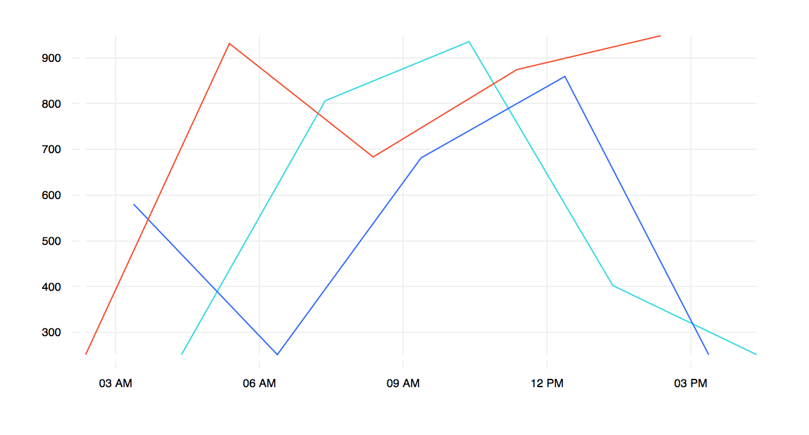
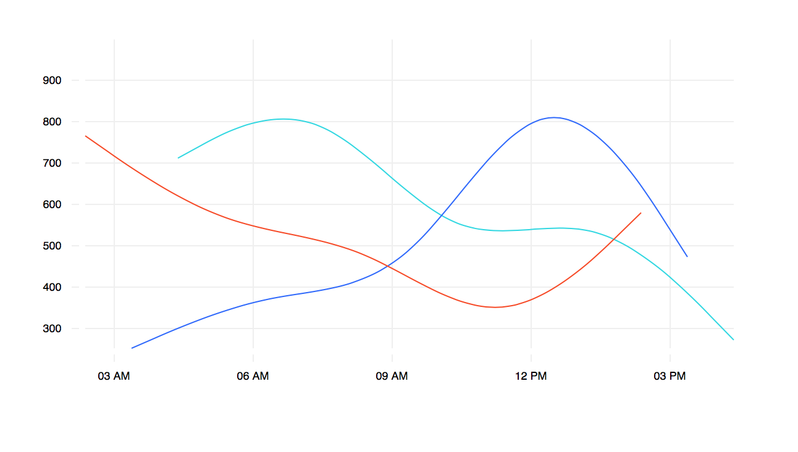

```javascript

const data = [
  {"symbol":"b","time":"2016-11-19T08:28:22.635Z","value":458},
  {"symbol":"c","time":"2016-11-19T07:28:22.635Z","value":250},
  {"symbol":"a","time":"2016-11-19T06:28:22.635Z","value":250},
  {"symbol":"b","time":"2016-11-19T05:28:22.635Z","value":250},
  {"symbol":"c","time":"2016-11-19T04:28:22.635Z","value":250},
  {"symbol":"a","time":"2016-11-19T03:28:22.635Z","value":927},
  {"symbol":"b","time":"2016-11-19T02:28:22.635Z","value":371},
  {"symbol":"c","time":"2016-11-19T01:28:22.635Z","value":250},
  {"symbol":"a","time":"2016-11-19T00:28:22.635Z","value":250},
];

//it will group data by symbol

const linechart = new LineChart({
  target: '#chart',
  width: 600,
  height: 300,
  grid: true
})

linechart.renderMultiLines(data)

```


### Add mutiple lines





